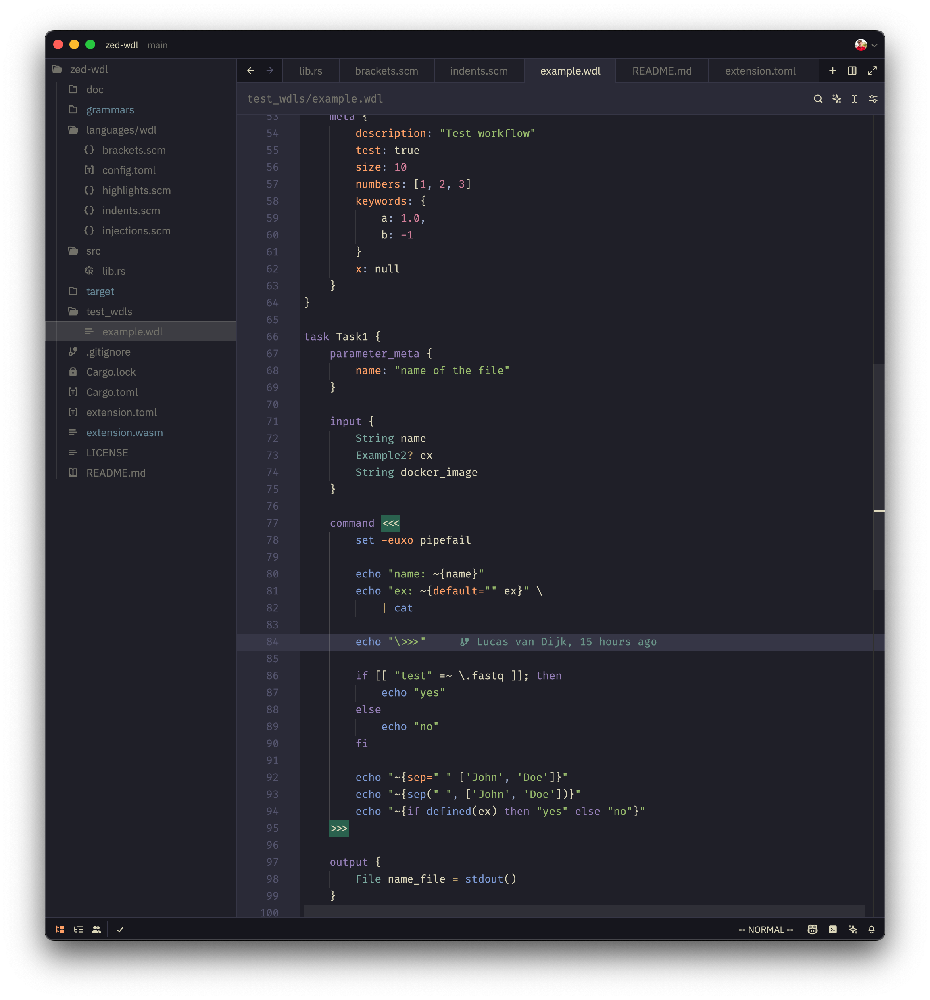

WDL extension for Zed
=====================

This extension provides support for the [Workflow Description Language (WDL)](https://openwdl.org/) 
in the [Zed](https://zed.dev) code editor. Currently supports WDL versions 1.0 and WDL 1.1

## Features

* Syntax highlighting (including bash syntax highlighting in command blocks)
* Automatic indentation
* Automatic closing of brackets

## Preview

